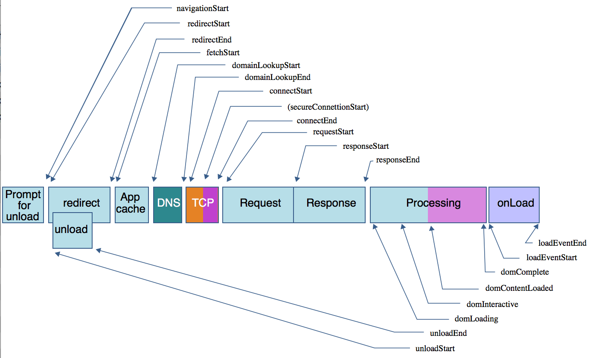

# Navigation Timing API
Also known as "Performance Timing API".

## Usage Notice
This API is now considered "old".  It still works and there is no deprecation warnings, but there are newer APIs introduced by Chrome that allow you to measure these metrics much easier.  The APIs are:
- [PerformanceObserver](https://developer.mozilla.org/en-US/docs/Web/API/PerformanceObserver)
- [PerformanceEntry](https://developer.mozilla.org/en-US/docs/Web/API/PerformanceEntry)
- [DOMHighResTimeStamp](https://developer.mozilla.org/en-US/docs/Web/API/DOMHighResTimeStamp)

## API Specifics
All browsers (IE 9+) provide a performance timing API ([MDN](https://developer.mozilla.org/en-US/docs/Web/API/Navigation_timing_API) or [w3.org](https://www.w3.org/TR/navigation-timing/#sec-navigation-timing-interface)), which can be accessed via `window.peformance.timing`.  According to MDN, the *Navigation Timing API* provides data that can be used to measure the performance of a website. Unlike other JavaScript-based mechanisms that have been used for the same purpose, this API can provide end-to-end latency data that can be more useful and accurate.  Using these timestamps you can easily calculate your website's time-to-interactive (TTI)!

The [list of events](https://developer.mozilla.org/en-US/docs/Web/API/PerformanceTiming), in order of occurrence, are:
  - **navigationStart** -- right after the prompt for unload terminates on the previous document in the same browsing context.  Note, if no previous document exists, this value is the same as `fetchStart`.
  - **unloadEventStart** -- if no previous document, or if the previous doc / redirects is not of the same origin, the value returned is 0.
  - **unloadEventEnd** -- if no previous document, or if the previous doc / redirects is not of the same origin, the value returned is 0.
  - **redirectStart** -- the timestamp of the first HTTP redirect start; if there is no redirect, or if one of the redirects is not of the same origin, the value returned is 0.
  - **redirectEnd** -- timestamps of when the last HTTP redirect is completed (when the last byte of the HTTP response has been received); if there is no redirect, or if one of the redirect is not of the same origin, the value returned is 0.
  - **fetchStart** -- when the browser is ready to fetch the document using an HTTP request; the moment is _before_ the check to any application cache.
  - **domainLookupStart** -- when the domain lookup starts; if a persistent connection is used, or info is stored in cache / local resource, the value should be the same as `.fetchStart`.
  - **domainLookupEnd** -- when the domain lookup is finished; if a persistent connection is used, or info is stored in cache / local resource, the value should be the same as `.fetchStart`.
  - **connectStart** -- when the request to open a connection is sent to the network.
  - **connectEnd** -- when the request to open a connection is sent to the network.
  - **secureConnectionStart** -- when the secure connection handshake starts; 0 is no such connection is requested.
  - **requestStart** -- when the browser sent the request to obtain the actual document, from the server or from a cache.
  - **responseStart** -- when the browser received the first byte of the response.
  - **responseEnd** -- when the browser received the last byte of the response, or when the connection is closed, from the server.
  - **domLoading** -- when the parser started its work; specifically, when `document.readyState` changes to `loading`.
  - **domInteractive** -- when the parser finished its work on the document; specifically, when `document.readyState` changes to `interactive`.
  - **domContentLoadedEventStart** -- right before the parser sent the `DOMContentLoaded` event; specifically, right after all the scripts that need to be executed right after the parsing has been executed.
  - **domContentLoadedEventEnd** -- right after all the scripts that need to be executed have been executed.
  - **domComplete** -- when the parser finished its work on the main document; specifically, when `document.readyState` changes to `complete`.
  - **loadEventStart** -- when the `load` event was sent for the current document.
  - **loadEventEnd** -- when the `load` event handler terminates; specifically, when the load event is completed.

TODO: explanation of [`performance.getEntries()`](https://developer.mozilla.org/en-US/docs/Web/API/Performance/getEntries)

## Recipes
**`performance.timing`** -- if you see the `.something` syntax below, it's because I removed the preface of `performance.timing` for purposes of examples.  Thus, in Chrome console, this `.domInteractive - .requestStart` should be this `performance.timing.domInteractive - performance.timing.requestStart`.

- `performance.getEntries()[0].domInteractive`
  - potentially a good measure of time to interactive (TTI)
  - in MS, around the time it takes from the moment the browser sends the request to the moment the DOM becomes interactive
  - _should_ be close to metric `.domInteractive - .requestStart`

- `performance.getEntriesByType('paint')[0].startTime`
  - time to first paint... which is the earliest possible point at which something appears after a user requests a page ([link](https://css-tricks.com/paint-timing-api/))
  - try typing this and examine the objects: `performance.getEntriesByType('paint')`
  - [learn more](https://developer.mozilla.org/en-US/docs/Web/API/Performance/getEntriesByType)

- `performance.timing.responseStart - performance.timing.requestStart`
  - time to first byte

- `performance.timing.responseEnd - performance.timing.requestStart`
  - time to last byte

- `.loadEventEnd - .navigationStart`
  - calculate total time required to load a page

- `.responseEnd - .requestStart`
  - calculate request response times
