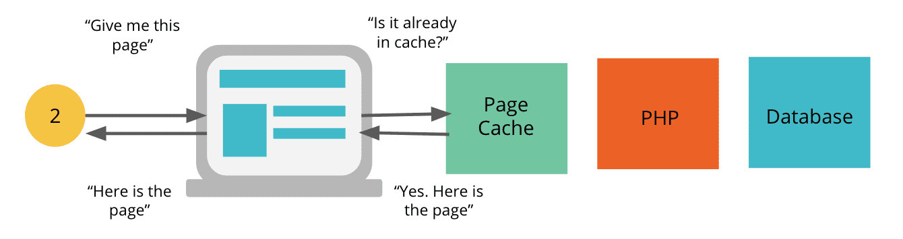
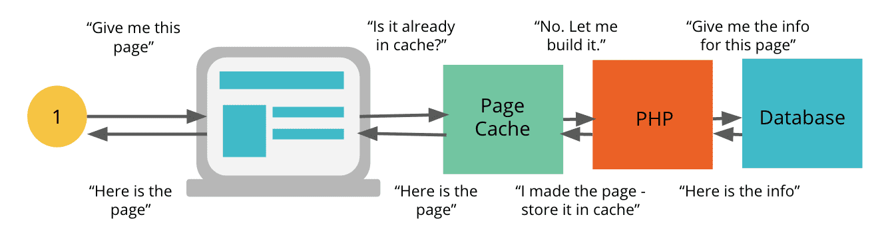
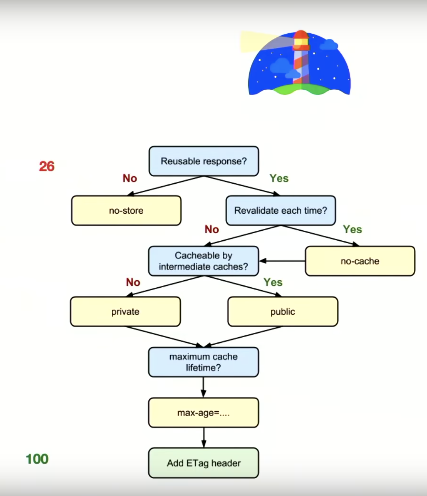

# What is caching?
Caching is the act of storing a _snapshot_ or _copy_ of a page or file for faster access the next time that page or file is requested. The file gets served from the _caching layer_, rather than sending the request all the way back to the server. A page served from cache can be returned in a fraction of the time it would take to serve the same uncached page or file. Caching also helps ease the strain on the server when you are getting large amounts of data.

Here is what the _cached_ workflow looks like:

Here is what the _uncached_ workflow looks like:

# Caching layers
Caching happens at many layers. 

## Browser-level caching (HTTP cache)

## Server-level caching

## Database-level caching
You can also cache queries to your database.  See _Wordpress_ section below for more details.

# Cache-control headers
**What are headers?**  Headers are contextual information your web browser sends (with the page/file request) and receives (with the page/file response) while it interacts with a server.

When a page or file is requested, the server and browser listen to the "Cache-Control" headers for instructions on **who** can access the cached copy and for **how long** the copy can be accessed.  

The Cache-Control headers are:
- **age**: 

- **cache-control**: tells the cache system (ie, browser or server) how long to cache the page in seconds. For example, when _max-age_ is set to 600, this means the page can be cached for 10 minutes.  Syntax looks like `Cache-Control: max-age=31536000` (which is `Access plus 1 year`).  Possible values include:
    - `no-store`: Tells the browser/client (or any intermediate caches) to not cache it at all. Used for returning personal or banking data. Eery request for this resource will require a full response.

    - `no-cache`: Used for mutable content that _always_ needs server revalidation (any locally-cached version is not trusted without the server's confirmation). In other words, it indicates that the returned response can't be used to satisfy a subsequent request to the same URL without first checking with the server. Note that `no-cache` does _not_ mean _don't cache_, it simply means the client must check with the server before using the content (ie, revalidate it).
        - Note: when used with a proper validation token (ETag), `no-cache` incurs a roundtrip to validate the cached response but can eliminate the download if the resource has not changed.

    - `max-age`: cached content _younger than_ the `max-age` seconds can be used without consulting the server. Used for when the content at this URL _never_ changes (you never change the content at a particular URL, you simply change the URL itself).  `max-age` on mutable content is almost always the wrong choice.  For example, this is when you see URLs with hashes in them, like `` or `<link rel="stylesheet" href="/styles-a837cb1e.css">`

    - `s-maxage`: 

    - `immutable`: 

    - `must-revalidate`: does _not_ mean _must revalidate_ but instead means the local resources can be used if it's younger than the provided `max-age`, otherwise it must revalidate.

    - `public` vs `private`: if the response is marked as "public", then it can be cached, even if it has HTTP auth associated with it. Most of the time, "public" isn't necessary because explicit caching info (like `max-age`) indicates that the response is cacheable anyway. By contrast, "private" responses can be cached by the browser but not any intermediate cache, like CDNs. For example, when a web page has private user info.

**Cache-Control Directives & Explanation**

| Directive            | Explanation   |
| -------------------- |-------------|
| `max-age=86400`        | Response can be cached by browser and any intermediary caches (that is, it's "public") for up to 1 day (60 seconds x 60 minutes x 24 hours). |
| `private, max-age=600` | Response can be cached by the client’s browser only for up to 10 minutes (60 seconds x 10 minutes).      |
| `no-store`             | Response is not allowed to be cached and must be fetched in full on every request. |

- **x-cache**: Will tell you whether the page was served from cache or not. A **HIT** indicates the request was served from the caching layer. A **MISS** indicates it did not hit cache.

- **x-pass-why**: This header will tell you the reason why the request did not hit the cache if you see _x-cache: MISS_.

- **x-cache-group**:

- **x-cacheable**:

- **ETag**: a validation token used to check if an expired resource has been modified. This enables efficient resource update checks because no data is transferred if the resource has not changed.  For example, when the browser sends the initial request, it includes the ETag value in its `If-None-Match` HTTP request header. If the fingerprint (the Etag value) still matches what is on the server, the server returns a `304 Not Modified` response, which tells the browser that the response it has in cache hasn't changed and can be renewed for another `max-age` time period.

- **Last-Modified**: 

- **If-Modified-Since**:

- **If-None-Match**: 

## Examples

- the HTML document cannot be cached and must be downloaded fresh everytime
- the CSS resource can be cached for one year by the browser and all intermediary resources.  Note the hashed URL so if the HTML has a different hashed URL, the browser will download a new CSS resource
- the JS is the same as the CSS except it's private so cannot be cached by intermediate caches (ie CDNs)... likely because it contains private or sensitive data.  And note that we can safely use a far future date of one year because of the hashed URL.
- the JPG is similar to the CSS except that it expires in one day and does not have a version or unique fingerprint so if it changes within a day, the browser may not know it changed (unless there is an ETag)

## Notes on Cache-Control headers
- a `304 Not Modified` response is used as a way for the server to indicate to the client that the resource has not changed and it should use whatever is in its cache.

- how do we take advantage of efficient revalidation (ie ETags)? The browser does all the work for us. It will automatically detect if a validation token has been previously specified, it appends the validation token to an outgoing request, and it updates the cache timestamps as necessary (based on the received response from the server).  All you have to do as an engineer is ensure your server is providing the necessary ETag tokens.

- **the combination of ETag, Cache-Control, and unique URLs (ie hashed URLs) allows you to deliver the best of all worlds: long-lived expiration times, control over where the response can be cached, and on-demand updates.**

# Performance recommendations
**Reduce external resources**: If you're calling an image, stylesheet, font, or other resource from a site that's not within your control, that resource if subject to the caching settings (if any) from the server that the external resource resides on. Thus, whenever possible, call these resources from your own site, so they can be served using your own caching layer.

# Best practices
- use consistent URLs (note URLs are case sensitive)
- ensure the server provides a validation token (ETag)
- identify which resources can be cached by intermediaries (private vs public)
- determine an optimal cache lifetime for each resource
- determine the best cache hierarchy for your site
- minimize churn through file chunking

# Wordpress

## Object caching
The object caching layer caches the results of repeated queries to the database. The server first looks for the query in the Object Cache layer and if it doesn't exist yet, the query is run on the db, and the result is stored in the Object Cache layer for next time.

For example, with Wordpress, let's say you have a plugin for redirects on your website. These redirects would be stored in your database. Your website would then require that list of redirects to load every time a page is loaded, by running a query to the database. But with an Object Cache layer, the server can easily access the same query much faster from the cache than from the db itself.

## Database cleanup & optimizations
- need to read: https://wpengine.com/support/database-optimization-best-practices/
- need to read: https://wpengine.com/support/wp-engines-object-caching/

## Plugins
- debug & monitor queries, API calls, etc: https://wordpress.org/plugins/query-monitor/
- set cache length & other settings: https://wordpress.org/plugins/wpe-advanced-cache-options/
- file minification & caching https://wordpress.org/plugins/autoptimize/
- optimize & compress images (creates webp files) https://wordpress.org/plugins/ewww-image-optimizer-cloud/

TODO: watch me: https://www.youtube.com/watch?v=vAgKZoGIvqs&feature=youtu.be&t=12m20s

# Sources
- https://developers.google.com/web/fundamentals/performance/optimizing-content-efficiency/http-caching
- Re-read me (esp section 2 & 3): https://jakearchibald.com/2016/caching-best-practices/
- https://wpengine.com/support/cache-control-headers-wp-engine/
- https://wpengine.com/support/tips-improving-page-cacheability/
- https://www.w3.org/Protocols/rfc2616/rfc2616-sec14.html#sec14.9
