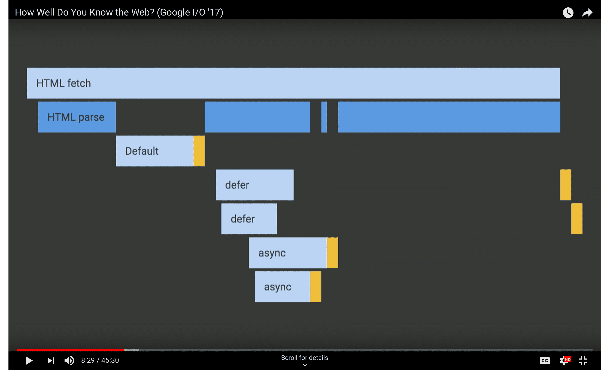

# Script tags
Script tags in HTML files will download, parse, and execute as soon they are encountered by the browser.

## normal (``)
- **BLOCKING**: blocks the browser parsing while they downloads and execute
- **EXECUTES**: executes immediately after downloading (very bad for performance)
- **WHEN TO USE**: when the script is critical (in situations where the JS is essential for the functionality of the page)

## defer (``)
- **BLOCKING**: does _not_ block the browser parsing while it downloads
- **EXECUTES**: executes once HTML parsing is complete
- **ORDER**: _always_ executes in the order in which the HTML parser discovers them
- **WHEN TO USE**: when the script is non-critical and when order matters

## async (``)
- **BLOCKING**: does _not_ block the browser parsing while it downloads
- **EXECUTES**: executes as soon as they finish downloading
- **ORDER**: which means they can run in a different order
- **WHEN TO USE**: when the script is non-critical and when order does _not_ matter
- **NOTES**: this could cause jank if the JS is big or complex because it could stop the functionality of your page as they execute (whereas defered scripts would execute after the page has loaded)

## general notes
- JS execution will _always_ block the HTML parser, as well as other JS execution

## images

## Resources
- https://www.youtube.com/watch?v=vAgKZoGIvqs&feature=youtu.be&t=12m20s